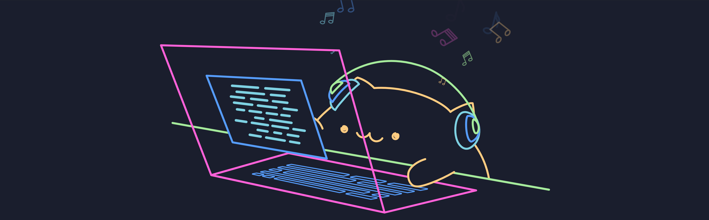

# Welcome to My GitHub Profile! 👋

## About Me

Hi there! I'm Mehrnoosh Yaghoubi, a passionate developer who loves creating innovative solutions and exploring new technologies. I enjoy working on projects that challenge me and help me grow as a professional.

- 🌱 Currently learning: [Your current focus, e.g., React, Machine Learning, etc.]
- 💬 Ask me about: [Your expertise, e.g., Web Development, Python, etc.]
- ⚡ Fun fact: I love cats and coding equally!

## My Skills

- **Languages**: [List your programming languages, e.g., JavaScript, Python, etc.]
- **Frameworks**: [List frameworks you use, e.g., React, Django, etc.]
- **Tools**: [List tools you use, e.g., Git, Docker, etc.]

## Projects

Here are some of my favorite projects:

- [Project 1](#): A brief description of the project.
- [Project 2](#): A brief description of the project.
- [Project 3](#): A brief description of the project.

## Let's Connect!

- **GitHub**: [MehrnooshYaghoubi](https://github.com/MehrnooshYaghoubi)
- **Email**: your-email@example.com
- **LinkedIn**: [Your LinkedIn Profile](#)

---

Thank you for visiting my profile! 😊